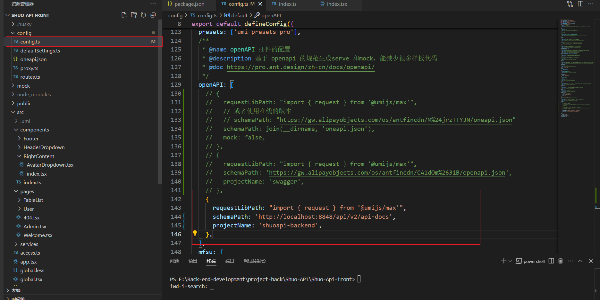
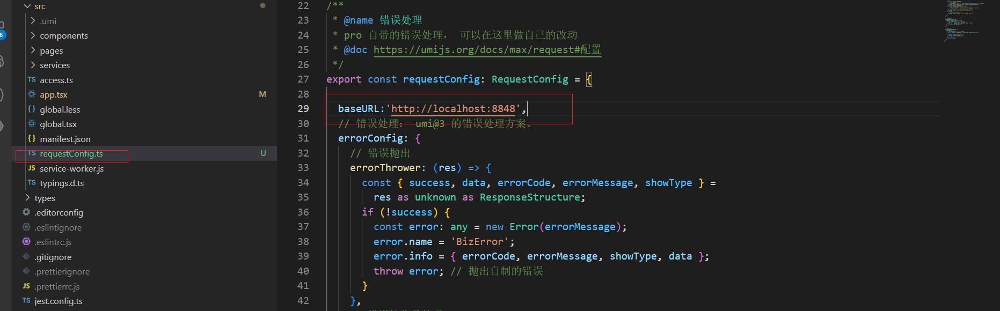
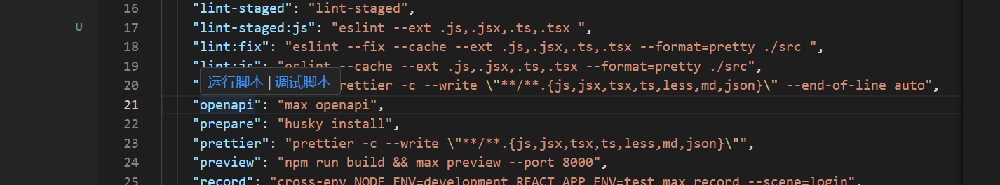
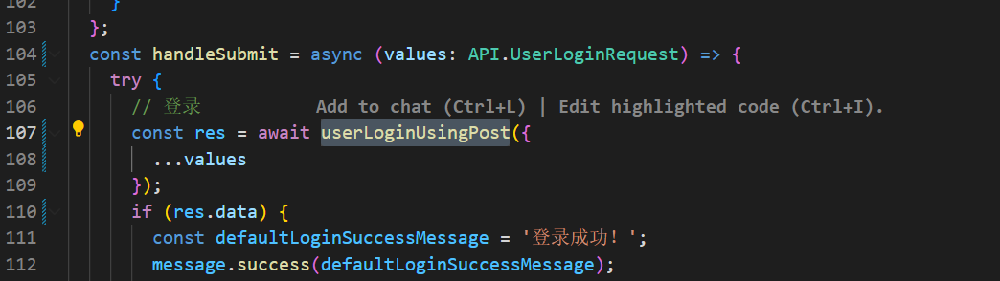
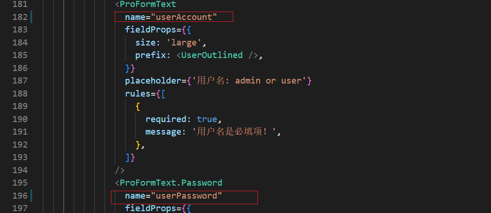
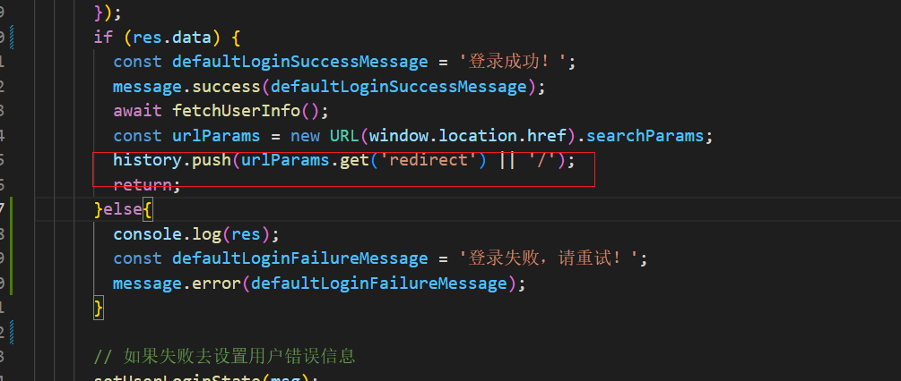
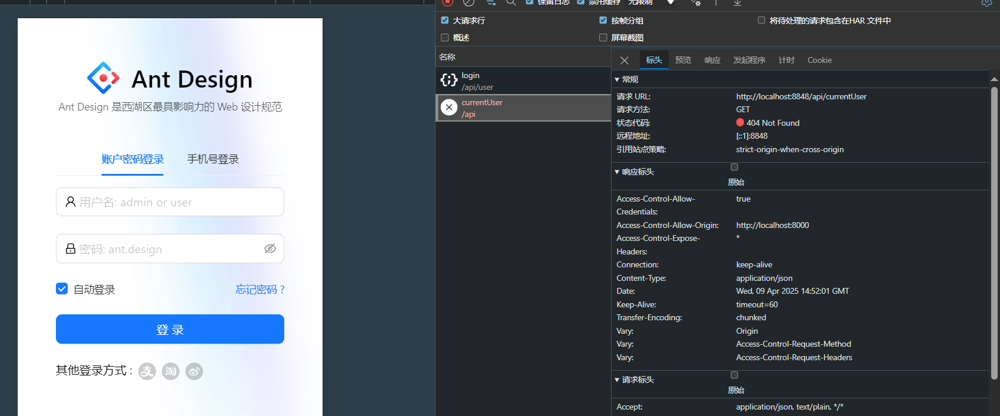
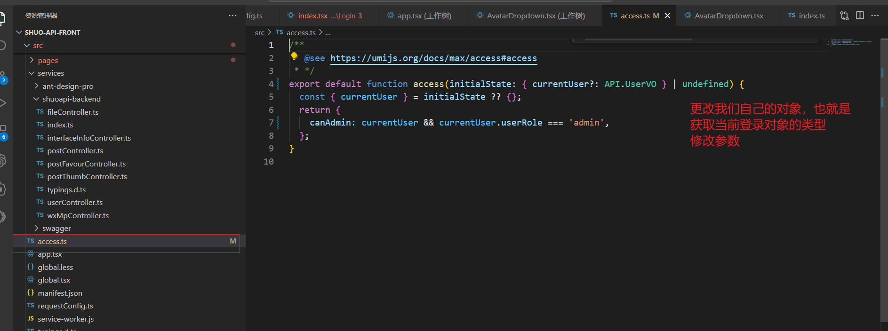

# 前端项目初始化

使用React Ant Design Pro [开始使用 - Ant Design Pro](https://pro.ant.design/zh-CN/docs/getting-started)

通过脚手架安装。

安装后，下载依赖，启动项目，可以先以mock启动

没问题，就删除不需要的模块。

1.先删除国际化：没啥用,脚本提供了删除，然后在删除文件， 删除后运行以下看是否出错。

antDesign 脚本写的不好，还有未删除的元素，那就手动删除， `SelectLang`

2.删除测试，删除后运行看是否报错

3.


# 后端项目初始化

使用自己总结的开发模板


# 库表设计

要做一个接口的开放平台，先实现基础的功能，用户的登录注册，以及管理，

```sql
-- 创建库
create database if not exists shuo_api;

-- 切换库
use shuo_api;

-- 用户表
create table if not exists user
(
    id           bigint auto_increment comment 'id' primary key,
    userAccount  varchar(256)                           not null comment '账号',
    userPassword varchar(512)                           not null comment '密码',
    unionId      varchar(256)                           null comment '微信开放平台id',
    mpOpenId     varchar(256)                           null comment '公众号openId',
    userName     varchar(256)                           null comment '用户昵称',
    userAvatar   varchar(1024)                          null comment '用户头像',
    userProfile  varchar(512)                           null comment '用户简介',
    userRole     varchar(256) default 'user'            not null comment '用户角色：user/admin/ban',
    editTime     datetime     default CURRENT_TIMESTAMP not null comment '编辑时间',
    createTime   datetime     default CURRENT_TIMESTAMP not null comment '创建时间',
    updateTime   datetime     default CURRENT_TIMESTAMP not null on update CURRENT_TIMESTAMP comment '更新时间',
    isDelete     tinyint      default 0                 not null comment '是否删除',
    index idx_unionId (unionId)
) comment '用户' collate = utf8mb4_unicode_ci;

```

其次就是接口的管理

```sql
-- 接口信息
create table if not exists yuapi.`interface_info`
(
  `id` bigint not null auto_increment comment '主键' primary key,
  `name` varchar(256) not null comment '名称',
  `description` varchar(256) null comment '描述',
  `url` varchar(512) not null comment '接口地址',
  `requestHeader` text null comment '请求头',
  `responseHeader` text null comment '响应头',
  `status` int default 0 not null comment '接口状态（0-关闭，1-开启）',
  `method` varchar(256) not null comment '请求类型',
  `userId` bigint not null comment '创建人',
  `createTime` datetime default CURRENT_TIMESTAMP not null comment '创建时间',
  `updateTime` datetime default CURRENT_TIMESTAMP not null on update CURRENT_TIMESTAMP comment '更新时间',
  `isDelete` tinyint default 0 not null comment '是否删除(0-未删, 1-已删)'
) comment '接口信息';

```


# 实现接口信息的增删改查

没啥

# 配置openapi

后端接口文档的json地址

如图



配置前端请求后端的地址



自动的生成接口调用




# 登录注册实现

现有的登录，请求的 是假的接口，所以我们修改登录页面的请求逻辑，让其请求我们后端自己的接口，同时要表单参数和请求参名称的对应。

主要：修改请求的axios,当然记得修改请求参数。





现在点击登录后，登录完成，并没有跳转

分析：有跳转逻辑没，代码中是有的。



控制台发现



改为请求我们自己的获取当前登录用户，更改请求地址，更改请求参数。没问题

没问题了，为什么还是跳转不了，原因是没有携带session，在全局的请求配置中允许携带session

```ts
 baseURL:'http://localhost:8848',
  withCredentials: true,
```

登录后头像不显示，一直转圈，就看头像组件的信息，参数不对。


fixbug: 管理页面不显示，

首先找到前端的管理认证的逻辑



