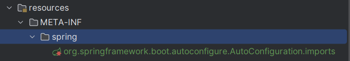
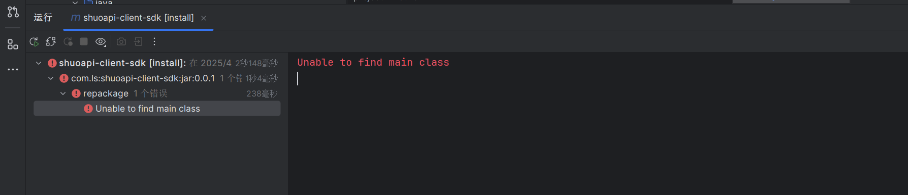
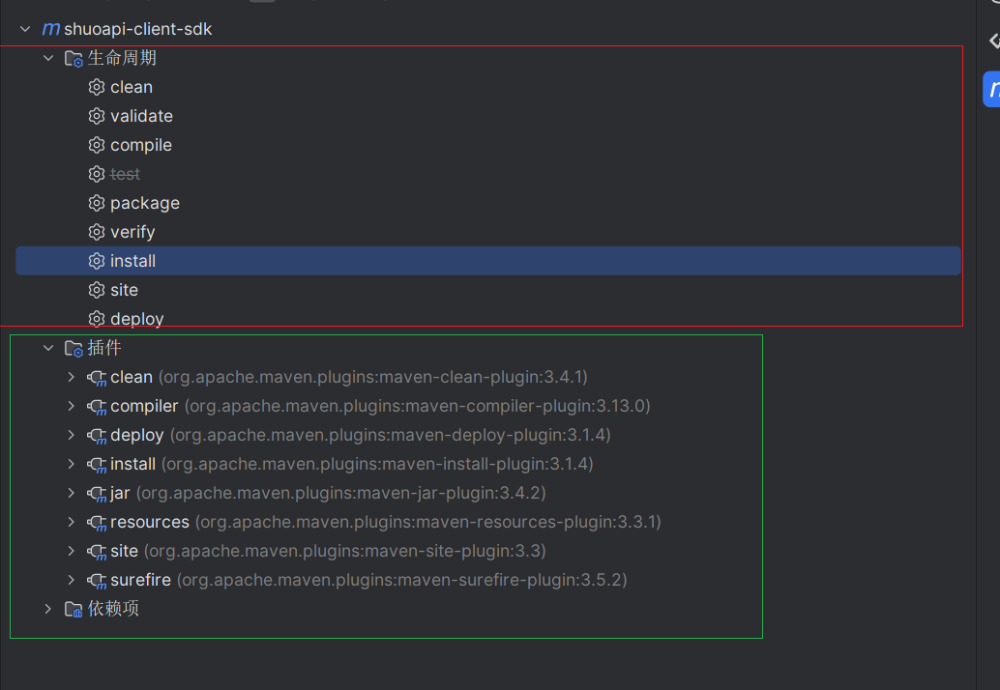
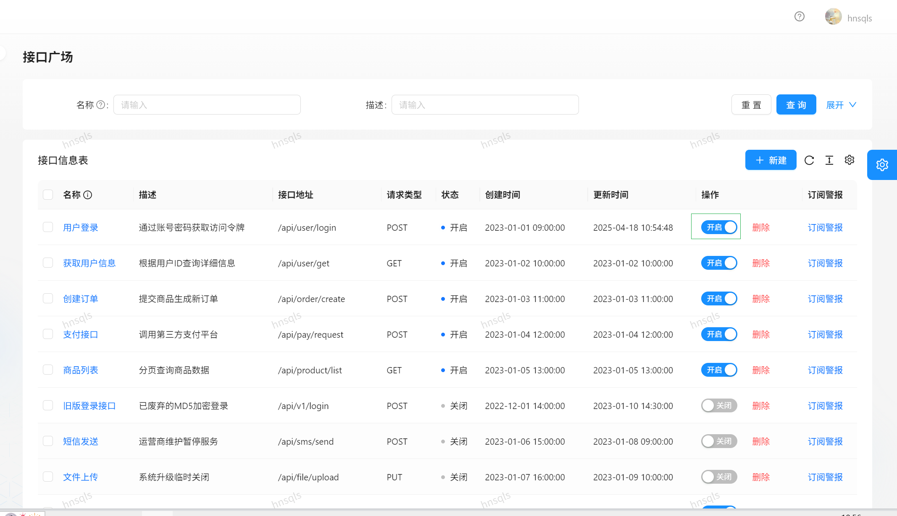

# 前端项目初始化

使用React Ant Design Pro [开始使用 - Ant Design Pro](https://pro.ant.design/zh-CN/docs/getting-started)

通过脚手架安装。

安装后，下载依赖，启动项目，可以先以mock启动

没问题，就删除不需要的模块。

1.先删除国际化：没啥用,脚本提供了删除，然后在删除文件， 删除后运行以下看是否出错。

antDesign 脚本写的不好，还有未删除的元素，那就手动删除， `SelectLang`

2.删除测试，删除后运行看是否报错

3.


# 后端项目初始化

使用自己总结的开发模板


# 库表设计

要做一个接口的开放平台，先实现基础的功能，用户的登录注册，以及管理，

```sql
-- 创建库
create database if not exists shuo_api;

-- 切换库
use shuo_api;

-- 用户表
create table if not exists user
(
    id           bigint auto_increment comment 'id' primary key,
    userAccount  varchar(256)                           not null comment '账号',
    userPassword varchar(512)                           not null comment '密码',
    unionId      varchar(256)                           null comment '微信开放平台id',
    mpOpenId     varchar(256)                           null comment '公众号openId',
    userName     varchar(256)                           null comment '用户昵称',
    userAvatar   varchar(1024)                          null comment '用户头像',
    userProfile  varchar(512)                           null comment '用户简介',
    userRole     varchar(256) default 'user'            not null comment '用户角色：user/admin/ban',
    editTime     datetime     default CURRENT_TIMESTAMP not null comment '编辑时间',
    createTime   datetime     default CURRENT_TIMESTAMP not null comment '创建时间',
    updateTime   datetime     default CURRENT_TIMESTAMP not null on update CURRENT_TIMESTAMP comment '更新时间',
    isDelete     tinyint      default 0                 not null comment '是否删除',
    index idx_unionId (unionId)
) comment '用户' collate = utf8mb4_unicode_ci;

```

其次就是接口的管理

```sql
-- 接口信息
create table if not exists yuapi.`interface_info`
(
  `id` bigint not null auto_increment comment '主键' primary key,
  `name` varchar(256) not null comment '名称',
  `description` varchar(256) null comment '描述',
  `url` varchar(512) not null comment '接口地址',
  `requestHeader` text null comment '请求头',
  `responseHeader` text null comment '响应头',
  `status` int default 0 not null comment '接口状态（0-关闭，1-开启）',
  `method` varchar(256) not null comment '请求类型',
  `userId` bigint not null comment '创建人',
  `createTime` datetime default CURRENT_TIMESTAMP not null comment '创建时间',
  `updateTime` datetime default CURRENT_TIMESTAMP not null on update CURRENT_TIMESTAMP comment '更新时间',
  `isDelete` tinyint default 0 not null comment '是否删除(0-未删, 1-已删)'
) comment '接口信息';

```


# 实现接口信息的增删改查

没啥

# 配置openapi

后端接口文档的json地址

如图


配置前端请求后端的地址


自动的生成接口调用


# 登录注册实现

现有的登录，请求的 是假的接口，所以我们修改登录页面的请求逻辑，让其请求我们后端自己的接口，同时要表单参数和请求参名称的对应。

主要：修改请求的axios,当然记得修改请求参数。


现在点击登录后，登录完成，并没有跳转

分析：有跳转逻辑没，代码中是有的。


控制台发现


改为请求我们自己的获取当前登录用户，更改请求地址，更改请求参数。没问题

没问题了，为什么还是跳转不了，原因是没有携带session，在全局的请求配置中允许携带session

```ts
 baseURL:'http://localhost:8848',
  withCredentials: true,
```

登录后头像不显示，一直转圈，就看头像组件的信息，参数不对。


fixbug: 管理页面不显示，

首先找到前端的管理认证的逻辑


# 接口列表的增删改查页面

实现页面的展示，以及请求后端对应的api.

修改colume字段的信息，修改请求

修改接口也没问题。

现在删除，新增还有点小问题。

删除问题：单个删除（新增），批量删除（未实现）

新增接口：修复字段


新增修改接口信息


# 开发接口调用

调用的几种方式


*  1. **OkHttp**

  **定位**：轻量级HTTP客户端
  **特点**：

  + 基于HTTP/2和连接池的高性能实现
  + 支持同步/异步调用
  + 灵活的拦截器机制
  + 需要手动处理JSON序列化

  **示例代码**：

  

  ```java
  // 同步GET请求
  OkHttpClient client = new OkHttpClient();
  Request request = new Request.Builder()
      .url("https://api.example.com/data")
      .build();
  Response response = client.newCall(request).execute();
  String responseData = response.body().string();
  
  // 异步请求
  client.newCall(request).enqueue(new Callback() {
      @Override
      public void onResponse(Call call, Response response) {
          // 处理响应
      }
  });
  ```

  ------

   2. **RestTemplate (Spring)**

  **定位**：Spring传统REST客户端
  **特点**：

  + 同步阻塞式调用
  + 集成Spring生态（如自动序列化）
  + 即将被弃用（推荐WebClient替代）

  **示例代码**：

  ```java
  RestTemplate restTemplate = new RestTemplate();
  String result = restTemplate.getForObject(
      "https://api.example.com/users/{id}", 
      String.class, 
      "123");
  ```

  ------

   3. **OpenFeign (Spring Cloud)**

  **定位**：声明式HTTP客户端
  **特点**：

  + 通过接口注解定义API
  + 集成Ribbon负载均衡
  + 支持熔断（配合Hystrix/Sentinel）
  + 自动序列化/反序列化

  **示例代码**：

  

  ```java
  @FeignClient(name = "user-service")
  public interface UserService {
      @GetMapping("/users/{id}")
      User getUser(@PathVariable("id") String id);
  }
  
  // 自动生成实现类
  UserService service = Feign.builder()
      .target(UserService.class, "https://api.example.com");
  ```

  ------

   4. **Hutool HttpUtil**

  **定位**：国产工具类HTTP封装
  **特点**：

  + 超简化的API设计
  + 适合快速开发和小项目
  + 功能相对基础

  **示例代码**：

  

  ```java
  // GET请求
  String result = HttpUtil.get("https://api.example.com/data");
  
  // POST表单
  HashMap<String, Object> paramMap = new HashMap<>();
  paramMap.put("key", "value");
  String result = HttpUtil.post("https://api.example.com/submit", paramMap);
  ```

  ------

   5. **WebClient (Spring 5+)**

  **定位**：响应式HTTP客户端
  **特点**：

  + 非阻塞IO（基于Netty）
  + 函数式API风格
  + 支持SSE/WebSocket
  + Spring官方推荐替代RestTemplate

  **示例代码**：

  ```java
  WebClient client = WebClient.create();
  Mono<String> result = client.get()
      .uri("https://api.example.com/data")
      .retrieve()
      .bodyToMono(String.class);
  
  // 阻塞获取结果（非响应式场景）
  String response = result.block();
  ```

  ------

   对比总结

  | 工具             | 同步/异步 | 学习成本 | 适用场景                  | 性能   | 扩展性       |
  | :--------------- | :-------- | :------- | :------------------------ | :----- | :----------- |
  | **OkHttp**       | 都支持    | 中       | 移动端/需要精细控制的场景 | 非常高 | 高（拦截器） |
  | **RestTemplate** | 同步      | 低       | 传统Spring应用            | 一般   | 中           |
  | **OpenFeign**    | 同步      | 中       | 微服务间调用              | 高     | 高           |
  | **Hutool**       | 同步      | 极低     | 简单HTTP请求              | 一般   | 低           |
  | **WebClient**    | 异步      | 高       | 响应式编程/高并发场景     | 非常高 | 高           |

  ------

   选型建议：

  1. **微服务开发**：优先选择 `OpenFeign` + 负载均衡
  2. **高性能需求**：`OkHttp` 或 `WebClient`
  3. **快速原型开发**：`Hutool HttpUtil`
  4. **响应式编程**：必须使用 `WebClient`
  5. **旧系统维护**：暂时保留 `RestTemplate`（逐步迁移）


那就使用Hutool吧：[Http客户端工具类-HttpUtil](https://www.hutool.cn/docs/#/http/Http客户端工具类-HttpUtil)

快速开发，简单的模拟几个接口调用

例如: GET POST  请求

参数 路径 url  json

```java
@RestController
@RequestMapping("/user")
public class UserController {

    @GetMapping("/name/{name}")
    public String getUserByGet(@PathVariable String name){
        return "GET:hello " + name;
    }

    @PostMapping("/name")
    public String getUserByPost(@RequestParam String name){
        return "POST:hello " + name;
    }

    @PostMapping("/json")
    public String getUserByJson(@RequestBody User user) {
        return "POST Json :hello " + user.getName();
    }
}
```

使用hutool HttpUtil  [Http客户端工具类-HttpUtil](https://www.hutool.cn/docs/#/http/Http客户端工具类-HttpUtil)

```java
/**
 * 调用接口的客户端
 */
@Component
public class ShuoApiClient {

    public String getUserByGet(String name){
        return HttpUtil.get("http://localhost:8849/api/user/name/" + name);
    }

    public String getUserByPost(String name){
        HashMap<String, Object> paramMap = new HashMap<>();
        paramMap.put("name", name);
        return HttpUtil.post("http://localhost:8849/api/user/name", paramMap);
    }

    public String getUserByJson(User user) {
        String json = JSONUtil.toJsonStr(user);
        HttpResponse execute = HttpRequest.post("http://localhost:8849/api/user/json")
                .body(json)
                .execute();
        return execute.body();
    }
}

```

# 签名认证开发

我们提供了接口调用，但是现在不知道有谁调用了。

不能随便调用，所以要认证

可以设计一个签名认证，我们给用户发送签名，用户调用接口需要携带该签名，根据该签名认证用户。

设计

* accessKey 
* secretKey

为啥不直接用登录的校验呢？登录的用户能调用不就行了，为什么还要设计accessKey以及secretKey.

要清楚，我们的API调用是提供给其他程序的，不是在本平台，也就是所以不能用登录认证，而是设计一个类似登录账号，密码的认证方式，允许调用API。

如何设计?

大概的思路

服务端：发放accessKey，以及secretKey。在调用的请求头，加上ack以及sck，进行认证。

调用的客户端修改-新增accessKey，secretKey 生成。 同时在发送请求时在请求头中携带accessKey,secretKey。

```java
/**
 * 调用接口的客户端
 */
public class ShuoApiClient {
    private String accessKey;
    private String secretKey;

    /**
     * 添加请求头信息
     *
     * @return
     */
    private HashMap<String, String> getHeaderMap() {
        HashMap<String, String> headers = new HashMap<>();
        headers.put("accessKey", accessKey);
        headers.put("secretKey", secretKey);
        return headers;
    }

    // 添加构造方法
    public ShuoApiClient(String accessKey, String secretKey) {
        this.accessKey = accessKey;
        this.secretKey = secretKey;
    }

    public String getUserByGet(String name) {
        return HttpRequest.get("http://localhost:8849/api/user/name/" + name)
                .addHeaders(getHeaderMap())
                .execute()
                .body();
    }

    public String getUserByPost(String name) {
        HashMap<String, Object> paramMap = new HashMap<>();
        paramMap.put("name", name);
        return HttpRequest.post("http://localhost:8849/api/user/name")
                .addHeaders(getHeaderMap())
                .form(paramMap)
                .execute()
                .body();
    }

    public String getUserByJson(User user) {
        String json = JSONUtil.toJsonStr(user);
        return HttpRequest.post("http://localhost:8849/api/user/json")
                .addHeaders(getHeaderMap())
                .body(json)
                .execute()
                .body();
    }
}
```

服务端，根据请求头中的数据进行校验,

主要就是从请求头中取出数据，进行校验，

```java
@RestController
@RequestMapping("/user")
public class UserController {

    @GetMapping("/name/{name}")
    public String getUserByGet(@PathVariable String name, HttpServletRequest request){
        String accessKey = request.getHeader("accessKey");
        String secretKey = request.getHeader("secretKey");
        if (!Objects.equals(accessKey, "hnsqls") || !Objects.equals(secretKey, "hnsqls")) {
            return "accessKey or secretKey is wrong";
        }

        return "GET:hello " + name;
    }

    @PostMapping("/name")
    public String getUserByPost(@RequestParam String name,HttpServletRequest request){
        String accessKey = request.getHeader("accessKey");
        String secretKey = request.getHeader("secretKey");
        if (!Objects.equals(accessKey, "hnsqls") || !Objects.equals(secretKey, "hnsqls")) {
            return "accessKey or secretKey is wrong";
        }
        return "POST:hello " + name;
    }

    @PostMapping("/json")
    public String getUserByJson(@RequestBody User user,HttpServletRequest request) {
        String accessKey = request.getHeader("accessKey");
        String secretKey = request.getHeader("secretKey");
        if (!Objects.equals(accessKey, "hnsqls") || !Objects.equals(secretKey, "hnsqls")) {
            return "accessKey or secretKey is wrong";
        }
        return "POST Json :hello " + user.getName();
    }
}

```

tips： 可以在写一个拦截器，或者AOP切面，进行校验。


上述存在一个问题，就是不安全，secretKey 相当于密码，我们不应该直接在请求头中携带，别人拦截了该请求就能使用该请求的accesskey,以及secretkey。拦截，重放就可以获得到请求头的信息。

为了安全考虑，我们不能直接传输该secretKey.而是应该选择加密后传出。

加密方式：单向加密(md5 签名)、对称加密、非对称加密。

 **1. 单向加密（哈希函数，如MD5）**

+ **特点**：
  + **不可逆**：无法从哈希值还原原始数据。
  + **固定输出长度**：无论输入大小，输出长度固定（如MD5为128位）。
  + **雪崩效应**：输入微小变化会导致哈希值巨大差异。
+ **常见算法**：MD5、SHA-1、SHA-256，等。
+ **用途**：
  + 数据完整性校验（如文件校验）。
  + 密码存储（需加盐防止彩虹表攻击）。
  + 数字签名中的消息摘要。
+ **缺点**：
  + MD5已被证明不安全（易碰撞），推荐使用SHA-256等更安全的哈希算法。

------

 **2. 对称加密**

+ **特点**：
  + **加解密使用相同密钥**。
  + **高效**：速度快，适合加密大量数据。
  + **密钥分发问题**：需安全通道共享密钥。
+ **常见算法**：
  + 块加密：AES（128/256位）、DES（已不安全）、3DES。
  + 流加密：ChaCha20、RC4（不安全）。
+ **用途**：
  + 数据库加密。
  + 文件或通信内容加密（如HTTPS中的部分环节）。
  + 加密大量数据的场景。
+ **缺点**：
  + 密钥管理困难（尤其在多用户场景）。

------

 **3. 非对称加密（公钥加密）**

+ **特点**：
  + **使用密钥对**：公钥（公开）和私钥（保密）。
  + **公钥加密，私钥解密**（或反之）。
  + **计算复杂**：速度慢，适合加密小数据或密钥交换。
+ **常见算法**：RSA、ECC（椭圆曲线）、DSA（用于签名）。
+ **用途**：
  + 数字签名（私钥签名，公钥验证）。
  + 密钥交换（如TLS中的RSA密钥交换）。
  + 加密对称密钥（混合加密系统）。
+ **缺点**：
  + 性能低，不适合加密大数据。
  + 需保护私钥，防止中间人攻击。

------

 **对比总结**

| **特性**       | **单向加密（MD5）**  | **对称加密（AES）** | **非对称加密（RSA）** |
| :------------- | :------------------- | :------------------ | :-------------------- |
| **密钥使用**   | 无密钥               | 相同密钥            | 公钥/私钥对           |
| **可逆性**     | 不可逆               | 可逆                | 可逆                  |
| **速度**       | 极快                 | 快                  | 慢                    |
| **用途**       | 完整性校验、密码存储 | 大数据加密          | 密钥交换、数字签名    |
| **安全性依赖** | 抗碰撞能力           | 密钥保密性          | 私钥保密性            |

------

 **实际应用场景示例**

1. **HTTPS通信**：
   + 非对称加密（RSA/ECC）用于交换对称密钥。
   + 对称加密（AES）加密实际传输数据。
   + 单向哈希（SHA-256）验证数据完整性。
2. **密码存储**：
   + 用户密码经SHA-256加盐哈希后存储，避免明文泄露。
3. **数字签名**：
   + 用私钥对消息哈希值签名，公钥验证签名真实性。

------

 **安全建议**

+ **避免使用MD5**：选择SHA-256或SHA-3。
+ **对称加密**：优先选AES-256，避免DES/3DES。
+ **非对称加密**：RSA密钥至少2048位，或使用更高效的ECC。

通过结合这三种技术（如混合加密系统），可在安全性和性能之间取得平衡。


对于API密钥选择怎么的加密方式呢？使用单向加密加盐处理。对于单线加密，也就是无法解密的，怎么验证呢？可以根据传入相同的参数进行生成，还生成后的数据是否一致。比如说一个用户获得了对应的accessKey,secretKey.那么使用单向加密，（accessKey+secretKey + userid + 盐）拼接后使用加密算法加密。等用户来验证的时候，获得userid,查询accessKey +SecretKey + 盐，加密运算，看是否一致。


加密算法： userId + 盐 + accesskey + secretKey  进行SHA-256. 、

实现操作

添加数据库字段accessKey，secretKey  Salt(随机盐，防止彩虹表攻击，偷个懒，直接使用固定盐了)。


tips: 防止重放  随机数+时间戳


客户端，添加发送请求携带头信息

```java

/**
 * 调用接口的客户端
 */
public class ShuoApiClient {
    private   String accessKey;
    private  String secretKey;

    /**
     * 添加请求头信息
     *
     * @return
     */
    private HashMap<String, String> getHeaderMap() {
        HashMap<String, String> headers = new HashMap<>();
        headers.put("accessKey", accessKey);
//        headers.put("secretKey", secretKey); 不能直接暴露
        headers.put("sign", getSign(accessKey,secretKey)); // 签名认证
        return headers;
    }

    public  static String getSign(String accessKey,String secretKey){
//        （accessKey+secretKey + userid + 盐）
        String SALT = "hnsqls";

        String sign = accessKey + SALT+ secretKey;
        // sha 256加密
        Digester sha256 = new Digester(DigestAlgorithm.SHA256);
        return sha256.digestHex(sign);
    }


    // 添加构造方法
    public ShuoApiClient(String accessKey, String secretKey) {
        this.accessKey = accessKey;
        this.secretKey = secretKey;
    }

    public String getUserByGet(String name) {
        return HttpRequest.get("http://localhost:8849/api/user/name/" + name)
                .addHeaders(getHeaderMap())
                .execute()
                .body();
    }

    public String getUserByPost(String name) {
        HashMap<String, Object> paramMap = new HashMap<>();
        paramMap.put("name", name);
        return HttpRequest.post("http://localhost:8849/api/user/name")
                .addHeaders(getHeaderMap())
                .form(paramMap)
                .execute()
                .body();
    }

    public String getUserByJson(User user) {
        String json = JSONUtil.toJsonStr(user);
        return HttpRequest.post("http://localhost:8849/api/user/json")
                .addHeaders(getHeaderMap())
                .body(json)
                .execute()
                .body();
    }
}

```


服务端验证

```java
@RestController
@RequestMapping("/user")
public class UserController {

    @GetMapping("/name/{name}")
    public String getUserByGet(@PathVariable String name, HttpServletRequest request){
        String accessKey = request.getHeader("accessKey");
        String sign = request.getHeader("sign");

        // todo  查数据库根据accessKey 查secretKey
        String secretKey = "hnsqls";// 模拟了先
        if (secretKey == null || accessKey.isEmpty()){
            return "accessKey or secretKey is wrong";
        }

        String checkSign = ShuoApiClient.getSign(accessKey,secretKey);
        if (!Objects.equals(accessKey, "hnsqls") || !Objects.equals(sign, checkSign)) {
            return "accessKey or secretKey is wrong";
        }

        return "GET:hello " + name;
    }

    @PostMapping("/name")
    public String getUserByPost(@RequestParam String name,HttpServletRequest request){
        String accessKey = request.getHeader("accessKey");
        String sign = request.getHeader("sign");

        // todo  查数据库根据accessKey 查secretKey
        String secretKey = "hnsqls";// 模拟了先
        if (secretKey == null || accessKey.isEmpty()){
            return "accessKey or secretKey is wrong";
        }

        String checkSign = ShuoApiClient.getSign(accessKey,secretKey);
        if (!Objects.equals(accessKey, "hnsqls") || !Objects.equals(sign, checkSign)) {
            return "accessKey or secretKey is wrong";
        }
        return "POST:hello " + name;
    }

    @PostMapping("/json")
    public String getUserByJson(@RequestBody User user,HttpServletRequest request) {
        String accessKey = request.getHeader("accessKey");
        String sign = request.getHeader("sign");

        // todo  查数据库根据accessKey 查secretKey
        String secretKey = "hnsqls";// 模拟了先
        if (secretKey == null || accessKey.isEmpty()){
            return "accessKey or secretKey is wrong";
        }

        String checkSign = ShuoApiClient.getSign(accessKey,secretKey);
        if (!Objects.equals(accessKey, "hnsqls") || !Objects.equals(sign, checkSign)) {
            return "accessKey or secretKey is wrong";
        }
        return "POST Json :hello " + user.getName();
    }
}

```

先保证流量打通，后期在优化：

todo :  AOP切面认证，防止重放，加上时间戳，随机中子数


# 开发SDK

 提供给其他开发者更好的使用，而不是每次使用客户端写重复的代码。

比如 调用接口的客户端，主要是添加请求头信息，签名算法加密，调用。我们写好后，可以给其他调用接口的开发者使用，而不是让其他调用者再次仿照下述例子，重写编写调用接口的客户端的逻辑，比如说签名生成的逻辑，调用服务的逻辑。
其他调用者不应该关注逻辑，只关注使用。仅仅提供accessKey和secretKey就行了。

```java
/**
 * 调用接口的客户端
 */
public class ShuoApiClient {
    private   String accessKey;
    private  String secretKey;

    /**
     * 添加请求头信息
     *
     * @return
     */
    private HashMap<String, String> getHeaderMap() {
        HashMap<String, String> headers = new HashMap<>();
        headers.put("accessKey", accessKey);
//        headers.put("secretKey", secretKey); 不能直接暴露
        headers.put("sign", getSign(accessKey,secretKey)); // 签名认证
        return headers;
    }

    public  static String getSign(String accessKey,String secretKey){
//        （accessKey+secretKey + userid + 盐）
        String SALT = "hnsqls";

        String sign = accessKey + SALT+ secretKey;
        // sha 256加密
        Digester sha256 = new Digester(DigestAlgorithm.SHA256);
        return sha256.digestHex(sign);
    }


    // 添加构造方法
    public ShuoApiClient(String accessKey, String secretKey) {
        this.accessKey = accessKey;
        this.secretKey = secretKey;
    }

    public String getUserByGet(String name) {
        return HttpRequest.get("http://localhost:8849/api/user/name/" + name)
                .addHeaders(getHeaderMap())
                .execute()
                .body();
    }

    public String getUserByPost(String name) {
        HashMap<String, Object> paramMap = new HashMap<>();
        paramMap.put("name", name);
        return HttpRequest.post("http://localhost:8849/api/user/name")
                .addHeaders(getHeaderMap())
                .form(paramMap)
                .execute()
                .body();
    }

    public String getUserByJson(User user) {
        String json = JSONUtil.toJsonStr(user);
        return HttpRequest.post("http://localhost:8849/api/user/json")
                .addHeaders(getHeaderMap())
                .body(json)
                .execute()
                .body();
    }
}
```


希望，可以提供一个stater,仅需要配置就可以使用。

**开发一个stater 让其他调用者引入该stater 编写简单的配置 比如accessKey 以及 secretKey**就可以使用


步骤如下，创建一个spring boot项目

引入依赖

```xml
   <dependencies>
        <dependency>
            <groupId>org.springframework.boot</groupId>
            <artifactId>spring-boot-starter</artifactId>
        </dependency>

        <dependency>
            <groupId>org.springframework.boot</groupId>
            <artifactId>spring-boot-configuration-processor</artifactId>
            <optional>true</optional>
        </dependency>
        <dependency>
            <groupId>org.projectlombok</groupId>
            <artifactId>lombok</artifactId>
            <optional>true</optional>
        </dependency>
        <dependency>
            <groupId>cn.hutool</groupId>
            <artifactId>hutool-all</artifactId>
            <version>5.8.16</version>
        </dependency>
    </dependencies>
```

对于通用的stater 主要是spring-boot-configuration-processor，提供了编写配置文件的自动配置。


明确我们的需求，**编写一个方便调用者使用的stater，也就是调用者仅仅通过配置就拿到客户端，然后直接使用**

编写客户端

```java
/**
 * 调用接口的客户端
 */

public class ShuoApiClient {
    private   String accessKey;
    private  String secretKey;

    /**
     * 添加请求头信息
     *
     * @return
     */
    private HashMap<String, String> getHeaderMap() {
        HashMap<String, String> headers = new HashMap<>();
        headers.put("accessKey", accessKey);
//        headers.put("secretKey", secretKey); 不能直接暴露
        headers.put("sign", getSign(accessKey,secretKey)); // 签名认证
        return headers;
    }

    public  static String getSign(String accessKey,String secretKey){
//        （accessKey+secretKey + userid + 盐）
        String SALT = "hnsqls";

        String sign = accessKey + SALT+ secretKey;
        // sha 256加密
        Digester sha256 = new Digester(DigestAlgorithm.SHA256);
        return sha256.digestHex(sign);
    }


    // 添加构造方法
    public ShuoApiClient(String accessKey, String secretKey) {
        this.accessKey = accessKey;
        this.secretKey = secretKey;
    }

    public String getUserByGet(String name) {
        return HttpRequest.get("http://localhost:8849/api/user/name/" + name)
                .addHeaders(getHeaderMap())
                .execute()
                .body();
    }

    public String getUserByPost(String name) {
        HashMap<String, Object> paramMap = new HashMap<>();
        paramMap.put("name", name);
        return HttpRequest.post("http://localhost:8849/api/user/name")
                .addHeaders(getHeaderMap())
                .form(paramMap)
                .execute()
                .body();
    }

    public String getUserByJson(User user) {
        String json = JSONUtil.toJsonStr(user);
        return HttpRequest.post("http://localhost:8849/api/user/json")
                .addHeaders(getHeaderMap())
                .body(json)
                .execute()
                .body();
    }
}
```

编写客户端发送请求的一些实体类,比如说user

```java

@Data
public class User {
    private String name;
    private String message;

    public String getName() {
        return name;
    }

    public void setName(String name) {
        this.name = name;
    }

    public String getMessage() {
        return message;
    }

    public void setMessage(String message) {
        this.message = message;
    }

    public User(String name, String message) {
        this.name = name;
        this.message = message;
    }
}
```

编写配置类，通过springboot的自动配置拿到客户端

```java
@Configuration
@ComponentScan
@Data
@ConfigurationProperties(prefix = "shuo.api")
public class ShuoApiClientConfig {

    private   String accessKey;
    private  String secretKey;

    @Bean
    public ShuoApiClient shuoApiClient(){
        return new ShuoApiClient(accessKey,secretKey);
    }
}

```

实现自动配置需要添加一个文件

注意springBoot  2.7 之前， 编写

spring.factories


内容demo如下

```xml
org.springframework.boot.autoconfigure.EnableAutoConfiguration=com.ls.shuoapiclientsdk.ShuoApiClientConfig
```


需要注意的是: 该stater，仅仅是提供sdk，所以可以移除主类也就是springboot的启动类，同时，构建该项目的时候，也仅仅是打jar包，打包插件要删除，否则会报错找不到主类。

spring 2.7 之后但是soringboot 3 之前

使用import导入，同时兼容老版本也就是上述写法


springboo 3 之后，只能使用import导入

在META-INF/spring/org.springframework.boot.autoconfigure.AutoConfiguration.imports



示例

```shell
com.ls.shuoapiclientsdk.ShuoApiClientConfig
```


下载打包

一定要移除构建项目的插件   声明周期 - >install

否则报错不能够找到主类,原因就是上述就是个sdk，删除了主类，没有用主类，仅仅打包就行，也不用构建



下载出错

```shell
The packaging plugin for project shuoapi-client-sdk did not assign a file to the build artifact

```

解决如下：使用红色而非绿色




测试SDK，是否正常使用

ok


# 发布接口和下线接口

上述已经实现，接口的新增，以及开启，关闭,包括修改



代码如下

```java
 /**
     * 更新（仅管理员） 发布接口和下线接口
     * @param interfaceInfoUpdateRequest
     * @return
     */
    @PostMapping("/update")
    @AuthCheck(mustRole = UserConstant.ADMIN_ROLE)
    public BaseResponse<Boolean> updateInterfaceInfo(@RequestBody InterfaceInfoUpdateRequest interfaceInfoUpdateRequest) {
        //参数逻辑校验
        if (interfaceInfoUpdateRequest == null || interfaceInfoUpdateRequest.getId() <= 0) {
            throw new BusinessException(ErrorCode.PARAMS_ERROR);
        }

        // todo 参数校验
        InterfaceInfo interfaceInfo = new InterfaceInfo();
        BeanUtils.copyProperties(interfaceInfoUpdateRequest, interfaceInfo);

        long id = interfaceInfoUpdateRequest.getId();
        // 判断是否存在
        InterfaceInfo oldInterfaceInfo = interfaceInfoService.getById(id);
        ThrowUtils.throwIf(oldInterfaceInfo == null, ErrorCode.NOT_FOUND_ERROR);
        boolean result = interfaceInfoService.updateById(interfaceInfo);
        return ResultUtils.success(result);
    }
```

todo: 在开启的时候应该先判断服务是否正常才能开启。

## 修改发布接口

在发布前，先测试接口是否正常，正常后才能发布接口。

在管理接口引入自定的sdk,进行判断